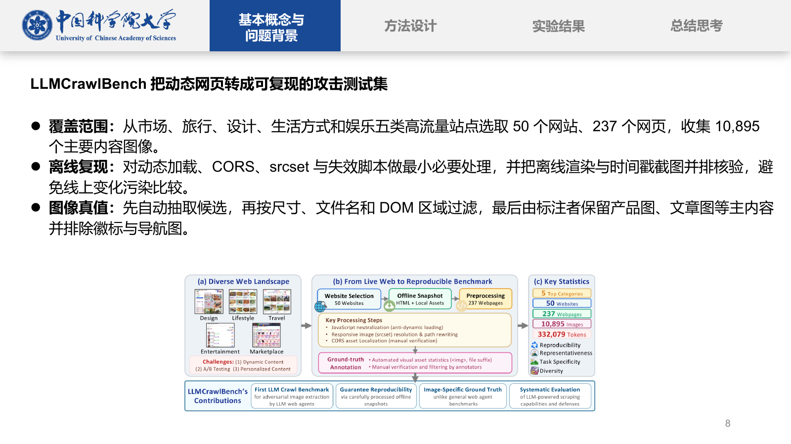
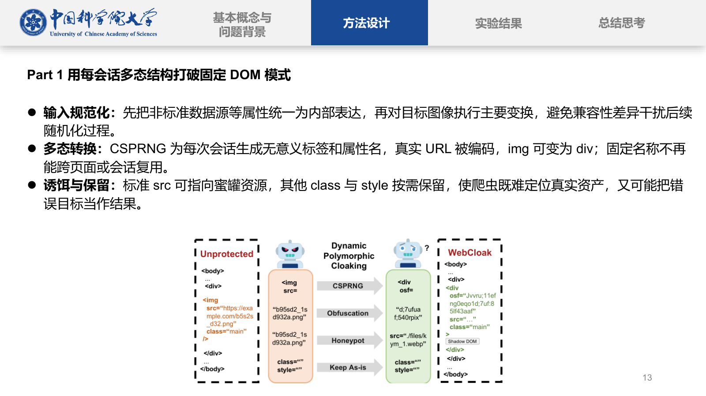
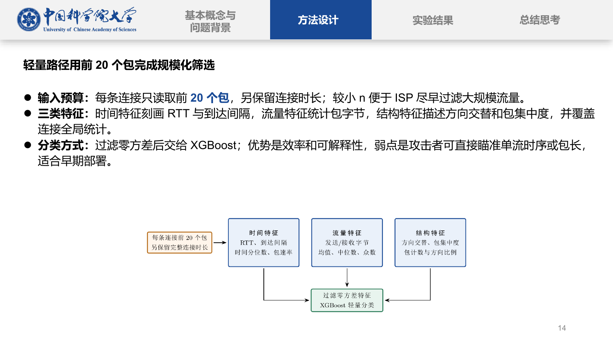
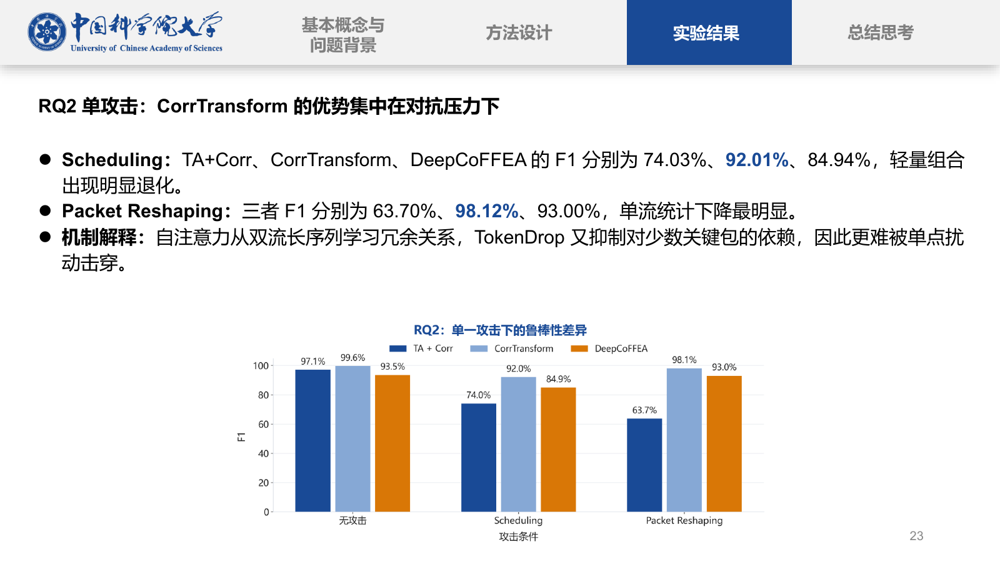
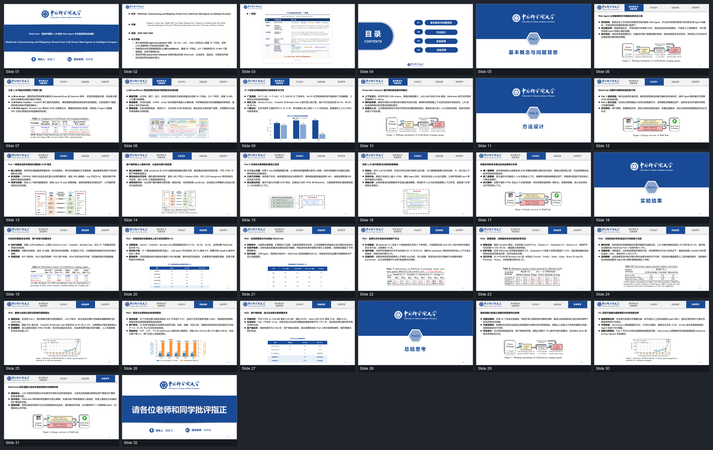
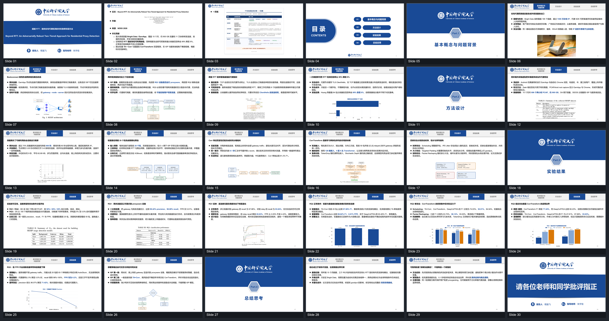

# Paper2Seminar

<p align="center"><strong>简体中文</strong> · <a href="README.en.md">English</a></p>

<p align="center"></p>

<p align="center"><strong>一篇论文，一句话，生成一套不像“一键生成”的组会 PPT。</strong></p>
<p align="center">专用于学术论文汇报的一键生成工作流：可编辑、够完整，也更像真实组会里的 PPT。</p>
<p align="center"><sub>📖 全文理解 &nbsp;→&nbsp; 🧭 结构规划 &nbsp;→&nbsp; 🖼️ 视觉路由 &nbsp;→&nbsp; 🛠️ 可编辑组装 &nbsp;→&nbsp; ✅ 多阶段 QA</sub></p>

<p align="center">
  
  
  
  
</p>

## 🎓 为什么要做这个项目

大模型已经能一键生成一套“看起来很完整”的 PPT，但对科研汇报来说，这种完整往往只是表面的：

- 整页被生成成一张图片，文字、图表和版式几乎无法继续修改；
- 每一页都像产品发布会一样精致、花哨，却不符合组会和讨论班的语境；
- PPT 已经做完了，模型却没有真正覆盖论文的方法小节和主要实验；
- 装饰性视觉替代了论文证据，关键边界条件和数值语境被压缩掉；
- 汇报人拿到的是一个“成品”，但自己无法有把握地解释、修正和继续打磨。

> [!CAUTION]
> **这些“一键生成”的痕迹，导师通常一眼就能看出来。**

真正尴尬的不只是“使用了 AI”，而是整套 PPT 带着明显的“一键生成感”：内容泛化、审美用力过猛、论文理解太浅，或者连一个错误都很难修改。它不像学生为组会准备的汇报，更像一次 AI 演示。

**Paper2Seminar 是一个专用于学术论文汇报的一次请求式生成工具。** 给它一篇论文和一句要求，它自动完成全文阅读、页数规划、逐页设计、视觉选择、可编辑 PPTX 组装和质量检查。

我们的目标是默认直接生成一份可靠的 **80 分组会 PPT**：完整度和精致度已经足够使用，同时保持普通科研汇报应有的克制。它未必比 ChatGPT 整页生图做出的 PPT 更惊艳，但不会让人第一眼就感到“这是大模型一键做的”。用户需要做的应当是事实核对和可选的个人化调整，而不是重新制作一遍。

> **一键，是交互方式；不是“一键生成感”的审美。**

## 🔍 什么叫“不像一键生成”

| 常见一键生成 PPT | Paper2Seminar |
|---|---|
| 输入提示词，直接得到一个看似完成的成品 | 先读论文，再做覆盖矩阵、逐页计划、资产生成、组装和 QA |
| 文字和页面被压成图片 | 输出可编辑的 PPTX 文字、形状、图片和讲稿备注 |
| 偏营销化的版式和装饰性变化 | 使用克制、稳定、符合科研语境的讨论班模板 |
| 图片首先服务于“好看” | 图片按用途选择：论文证据、精确重绘、TikZ 综合图或概念图 |
| 长论文被概括成几页泛化总结 | 根据论文复杂度分配页数，并检查小节级覆盖情况 |
| 修改一个结论可能需要整套重生成 | `deck-plan.json` 始终是可审查、可修改的单一事实源 |
| “看起来做完”就等于完成 | 资产审批、逐页审批、结构检查和可选可读性检查缺一不可 |

这里的“有人味”不是故意制造粗糙和瑕疵，而是遵循真实组会里熟悉的表达方式：信息密度合理、设计克制、图表来自论文、对象保持可编辑，整套叙事也能对应论文真实结构。

## 🖼️ 看看实际产出

下面全部来自工作流生成的完整 PPT，不是为了 README 单独手工制作的效果图。

<table>
  <tr>
    <td width="50%" align="center">
      <a href="examples/gallery/webcloak-paper-evidence.png"></a><br>
      <sub><strong>论文证据</strong> — 保留原始研究内容和必要语境</sub>
    </td>
    <td width="50%" align="center">
      <a href="examples/gallery/webcloak-method.png"></a><br>
      <sub><strong>方法机制</strong> — 围绕论文图表进行克制解释</sub>
    </td>
  </tr>
  <tr>
    <td width="50%" align="center">
      <a href="examples/gallery/beyond-rtt-tikz.png"></a><br>
      <sub><strong>TikZ 综合图</strong> — 将多个论文小节整理成适合讲解的结构</sub>
    </td>
    <td width="50%" align="center">
      <a href="examples/gallery/beyond-rtt-results.png"></a><br>
      <sub><strong>数据重绘</strong> — 使用准确可比数值生成可编辑学术图表</sub>
    </td>
  </tr>
</table>

### 🗺️ 完整大纲总览

<details>
  <summary><strong>WebCloak — 32 页完整讨论班 PPT</strong></summary>
  <p align="center"><a href="examples/gallery/webcloak-overview.png"></a></p>
</details>

<details>
  <summary><strong>Beyond RTT — 30 页完整讨论班 PPT</strong></summary>
  <p align="center"><a href="examples/gallery/beyond-rtt-overview.png"></a></p>
</details>

| 可编辑样例 | 页数 | 下载 |
|---|---:|---|
| WebCloak · IEEE S&P 2026 | 32 | [PPTX](examples/decks/webcloak-seminar.pptx) |
| Beyond RTT · NDSS 2026 | 30 | [PPTX](examples/decks/beyond-rtt-seminar.pptx) |

两份 PPTX 均通过 OpenXML 校验，OfficeCLI 未报告结构问题。验证信息及论文第三方内容的权利边界见 [样例说明](examples/README.md)。

## 🧭 这种效果是怎样被控制出来的

不存在一句万能的“生成得像人做的”提示词。这个项目依靠一条受约束的技术路线获得稳定结果：

<p align="center">
  
</p>
<p align="center"><sub>证据包沿受控流水线逐步推进；每个模块都有明确输入、状态与质量门禁。</sub></p>

<details>
<summary><strong>查看文本版完整流程</strong></summary>

```text
paper.pdf
  -> 完整论文清单
  -> 小节覆盖矩阵
  -> 按复杂度确定页数
  -> 有序的 deck-plan.json
  -> 按证据类型选择视觉路线
  -> 独立审核视觉资产
  -> 确定性组装可编辑 PPTX
  -> 结构 + 内容 + 视觉 QA
  -> 后置生成并写入逐页逐字稿
```

</details>

### 🧠 内容控制

- 在规划 PPT 前完整阅读论文，而不是只读取摘要和结论。
- 将核心方法小节、研究问题和主要实验逐一映射到幻灯片。
- 先写完整标题序列，再开始生成图片和修改 PPT。
- 区分论文原始结论与汇报者分析，并保留关键数值的准确语境。

### 🎨 视觉控制

- 方法和实验结果优先使用论文原图。
- 只有存在准确、可比较数据时才使用 Matplotlib 重绘。
- 使用 TikZ 表达跨小节综合得到的机制、流程和因果关系。
- 生图和外部图片只服务于概念表达，不能冒充实验或系统结构证据。
- 所有裁剪图、综合图和生成图必须先独立审核，再进入 PPT。

### 🧱 格式控制

- 从完整的 16:9 讨论班模板组装，而不是把每页绘制成不可编辑位图。
- 正文、强调、图片、页序、讲稿备注和替代文本继续保留为可编辑 PPTX 对象。
- 默认采用克制、固定的正文布局，让页面像科研汇报，而不是营销网站。

### 🛡️ 质量控制

- 在生成资产前、组装前和最终审批后分别校验 `deck-plan.json`。
- 每次运行记录工具能力、输入输出路径、hash 和审批状态。
- PowerPoint 页面渲染是可选检查，不阻塞核心 PPTX 组装。
- 脚本成功只是必要条件，不能代替论文语义和最终视觉审核。

## 📦 最终会得到什么

- 一份完整的中文讨论班 PPT，并保留必要的英文技术术语。
- 一份由 OfficeCLI 从固定模板组装的可编辑 `.pptx`。
- 包含逐页正文、视觉决策、讲稿和审核状态的 `deck-plan.json`。
- 核心页面审批后生成并写入每一页备注的约 30 分钟逐字稿。
- 论文裁剪图、手动裁剪来源、TikZ 源文件、数据重绘规格和运行 manifest。
- 一张通过浏览器渲染的论文一页纸总结。
- 可选的全局总览图或分组可读性检查图。

当前工作流最适合 12–16 页以上的系统、安全、网络和测量类论文。除非用户明确要求短讲，完整论文通常会得到 26–32 页 PPT。

## 🚀 快速开始

将仓库作为 agent 的工作目录打开，提供论文 PDF，然后提出类似请求：

```text
请使用 paper-ppt-orchestrator，将 ./paper.pdf 制作成完整可交付的中文讨论班 PPT。按默认流程执行，并输出到新的 runs 目录。
```

Codex 可以显式调用：

```text
请使用 $paper-ppt-orchestrator，将 ./paper.pdf 制作成完整可交付的中文讨论班 PPT。
```

也可以启动本地任务控制台，上传论文并配置模板、汇报人、时长、图表裁剪、质量检查和逐页讲稿：

```text
python -m pip install -r requirements-ui.txt
streamlit run skills/paper-ppt-orchestrator/webapp/streamlit_app.py
```

> [!WARNING]
> **Web UI 目前为测试版，功能尚不稳定，可能出现任务创建失败、状态同步异常等情况。** 推荐优先使用对话式 Skill 调用方式（见上方示例）。生成的 `deck-plan.json` 和中间产物仍可正常使用，只是 UI 层的前后端交互仍在完善中。

当前 UI 使用本机已安装并登录的 Codex CLI 执行完整 Agent Skill 工作流。任务、日志和产物保存在独立的 `runs/ui-*` 目录；具体接口边界见 [Web UI 说明](docs/web-ui.md)。

UI、对话式 Skill 和 CLI 共用同一个版本化 `job-request.json` 契约及同一组默认 profile。UI 已确认的字段不会被 agent 重复询问；普通 Skill 调用默认只做一次集中确认。配置扩展规则、交互模式和命令示例见 [任务配置契约](docs/job-request.md)。

Codex 和 OpenCode 可通过 `.agents/skills/paper-ppt-orchestrator` 自动发现，Claude Code 可通过 `.claude/skills/paper-ppt-orchestrator` 自动发现。

## 🧰 环境要求

核心流程需要：

- 具备文件系统和 Shell 工具的 agent 模型。
- Python 3.10+ 及 `requirements.txt` 中的依赖。
- [OfficeCLI](https://officecli.ai/)，用于检查和组装 PPTX。
- Chromium 系浏览器，用于渲染一页纸 HTML。
- 完整流程选择 TikZ 时需要 XeLaTeX 和 `pdftoppm`。

可选能力：

- `requirements-doclayout.txt` 中的默认 DocLayout 图表检测后端，以及单独下载并校验的固定模型。
- CaptionCrop 作为保留的轻量抽取后端；带来源记录的手动裁剪仍是最终回退。
- 图片生成或具有明确授权信息的网络图片搜索。
- Windows PowerPoint，用于可选的高保真最终尺寸检查；核心组装不依赖它。

安装并运行默认的论文图表抽取器：

```text
python -m pip install -r requirements-doclayout.txt
python skills/paper-ppt-orchestrator/scripts/paper_ppt.py download-layout-model
python skills/paper-ppt-orchestrator/scripts/paper_ppt.py extract-assets paper.pdf -o runs/demo/assets/paper/extracted --clean
```

默认路线只使用 DocLayout-YOLO 检测图和表的区域，再以 300 DPI 从 PDF 原始页面裁剪，输出相对路径 manifest、标注页和 contact sheet。要使用原来的轻量路线，显式传入 `--backend captioncrop --captioncrop-command PATH`。模型校验、已知边界和 AGPL 许可说明见[图表抽取契约](skills/paper-ppt-orchestrator/references/figure-extraction.md)。

视觉规划前可以执行能力预检：

```text
python skills/paper-ppt-orchestrator/scripts/paper_ppt.py preflight -o runs/demo/capabilities.json --imagegen unavailable --web-search unavailable
```

## 🔌 框架安装

独立安装时，将 `skills/paper-ppt-orchestrator/` 整体复制到对应框架目录：

| 框架 | 安装位置 | 常用调用方式 |
|---|---|---|
| Codex | `$CODEX_HOME/skills/paper-ppt-orchestrator` 或 `~/.codex/skills/paper-ppt-orchestrator` | `$paper-ppt-orchestrator` |
| OpenCode | 项目 `.agents/skills/paper-ppt-orchestrator` 或配置的 skill 目录 | 自然语言请求或 skill 工具 |
| Claude Code | `.claude/skills/paper-ppt-orchestrator` 或 `~/.claude/skills/paper-ppt-orchestrator` | `/paper-ppt-orchestrator` |

`agents/openai.yaml` 保留标准文件名。它只是 Codex 的可选界面元数据；可移植的工作流定义仍然是 `SKILL.md`。

完整边界见 [框架与平台兼容性说明](docs/compatibility.md)。

## 🗂️ 仓库目录

```text
.
|-- .agents/skills/paper-ppt-orchestrator/   # Codex/OpenCode 仓库加载器
|-- .claude/skills/paper-ppt-orchestrator/   # Claude Code 仓库加载器
|-- skills/paper-ppt-orchestrator/           # 可独立分发的规范 skill
|   |-- SKILL.md
|   |-- agents/openai.yaml
|   |-- assets/
|   |-- references/
|   `-- scripts/
|-- examples/
|   |-- decks/                                 # 精选的可编辑样例 PPTX
|   `-- gallery/                               # 精选页面与完整大纲总览
|-- tests/
`-- docs/
```

`skills/paper-ppt-orchestrator/` 是唯一的规范实现；两个隐藏目录只是仓库内的自动发现入口。

## ⚠️ 当前边界

- 项目提供可靠的首轮交付物，不承诺无人监督的最终真理。
- 语义准确性仍取决于模型是否正确理解论文以及最终人工审核。
- 当前正文布局有意保持固定和克制，而不是追求无限主题和版式变化。
- Web UI 当前只实现 Codex CLI 执行适配；其他 agent、增量重建、多版式和证据脚注仍为预留项。
- 随附模板保留现有国科大视觉标识和默认汇报人/指导老师姓名，需要时可在幻灯片母版、封面和结束页中替换。
- 论文 PDF 和 `runs/` 不进入版本控制；只有经过验证并附带第三方内容说明的展示样例保存在 `examples/` 中。

## 📊 与现有方案的定位对比

下面比较的是各项目或产品截至 **2026-07-25** 在官方仓库、论文或帮助中心公开的能力，不是同一数据集和统一评价协议下的性能排名。“整页图像”表示修改文字通常需要重新生成页面；“源码级”表示可编辑 LaTeX 等源文件，但不是原生 PowerPoint 对象；“对象级”表示可在对应演示软件中继续编辑文字、形状或图表，具体覆盖范围仍以各产品当前版本为准。

| 方案 | 论文适配 | 主要成品与编辑层级 | 论文证据与流程特点 | 开源 / 使用形态 |
|---|---|---|---|---|
| [HKUDS/Paper2Slides](https://github.com/HKUDS/Paper2Slides) | 论文、报告及通用文档 | **整页图像**：逐页 PNG + 汇总 PDF | RAG、图表与结构抽取、来源关联、分阶段 checkpoint；视觉路线侧重逐页图像生成 | MIT；本地 CLI + 自托管 Web |
| [takashiishida/paper2slides](https://github.com/takashiishida/paper2slides) | 专注 arXiv LaTeX 论文 | **源码级**：Beamer `.tex` + PDF，不输出 PPTX | 利用 LaTeX 与 caption 组织内容和图片；支持 LLM 自检与可选 linter 回修 | MIT；本地 CLI / Streamlit，依赖 `pdflatex` 与模型 API |
| [OpenDCAI/Paper2Any](https://github.com/OpenDCAI/Paper2Any) | 论文、文本、主题及多模态输入 | **对象级**：可编辑 PPT/PPTX；另有 SVG、draw.io、海报和视频路线 | Paper2PPT 支持长文档、图表抽取、在线大纲与画布编辑；覆盖科研多模态工作流 | Apache-2.0；可自部署；官方说明托管 Studio 与开源代码存在差异，且未完全开源 |
| [PPTAgent / DeepPresenter](https://github.com/icip-cas/PPTAgent) | 通用主题、附件与参考演示文稿 | **对象级**：PPTX；参考模板编辑与自由布局两条路线 | 从参考演示提取功能类型与内容 schema；包含 Content / Design / Coherence 评价和环境反思路线 | MIT；CLI / WebUI / MCP；Windows 需 WSL |
| [Presenton](https://github.com/presenton/presenton) | 提示词或上传文档，通用演示场景 | **对象级**：官方声明 fully editable PPTX；同时导出 PDF | 自定义模板、拖拽编辑、BYOK、多模型与图片来源、生成 API；不是论文小节覆盖型流程 | Apache-2.0；Docker 自托管、桌面端与 API |
| [ChatGPT Work](https://help.openai.com/en/articles/20001278-creating-and-editing-documents-spreadsheets-and-presentations-with-chatgpt-work) / [ChatGPT for PowerPoint](https://help.openai.com/en/articles/20001242-chatgpt-for-powerpoint) | 通用来源材料、长文和已有模板 | **对象级**：Work 可创建原生 Google Slides；PowerPoint 插件保留可编辑幻灯片结构 | 支持参考文件、模板、故事线与缺口审阅；官方同时提示高级图表、形状和格式编辑仍可能受限 | 托管产品 / PowerPoint 插件；能力取决于套餐、工作区与 rollout |
| [Kimi Slides](https://www.kimi.com/zh-cn/features/slides) | 主题、PDF、Word、PPTX、Excel、Markdown 与图片 | **对象级**：在线编辑并导出 PowerPoint 或 PNG；官方称文字、形状和图表均可编辑 | 长文本理解、搜索与页面引用、文档内图片复用、自定义模板和原生图表组件 | 托管 Web / App 产品 |
| **Paper2Seminar（本项目）** | **专注完整学术论文与组会汇报** | **对象级**：PPTX 文字、形状、讲稿和强调可编辑；论文裁剪图保持图片资产 | **全文阅读 + 小节覆盖矩阵 + 论文图表溯源 + 精确数据重绘 + TikZ 综合图 + 资产/页面审批 + 可选可读性 QA** | **MIT Agent Skill；本地运行，模型与第三方工具许可单独管理** |

这张表强调的是技术路线差异：图像生成路线通常更容易获得统一视觉风格；Beamer 路线保留学术排版和公式优势；通用原生 PPT 工具更适合广泛办公场景；Paper2Seminar 则把主要约束放在完整论文覆盖、证据忠实度、普通组会语境和可审查交付物上。

## ✅ 开发验证

```text
python -m pip install -r requirements.txt
# 可选：真实模型抽取测试与使用
python -m pip install -r requirements-doclayout.txt
python -m unittest discover -s tests -v
python skills/paper-ppt-orchestrator/scripts/paper_ppt.py job-request validate examples/job-request.example.json
python skills/paper-ppt-orchestrator/scripts/validate_deck_plan.py examples/deck-plan.example.json --stage plan
```

修改 `deck-plan.json` 契约、builder 或模板前，请先阅读 [架构说明](docs/architecture.md) 和 [贡献指南](CONTRIBUTING.md)。

## 📄 许可证

仓库原创代码和文档采用 MIT License。第三方工具遵循各自许可证。随附模板中的国科大名称和标识不因本仓库采用 MIT License 而获得额外授权，不适用时请自行替换。具体边界见 [THIRD_PARTY.md](THIRD_PARTY.md)。

如果这个工作流帮助你避开了“明显的一键生成 PPT”和“全部推倒重做”之间的两难，欢迎给仓库一个 Star。它也能帮助我们判断，这是否是更多研究生和科研团队共同面对的问题。
